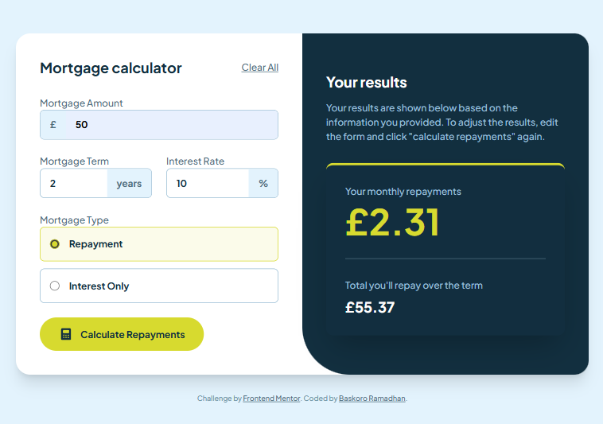
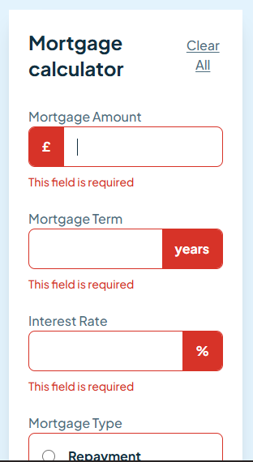
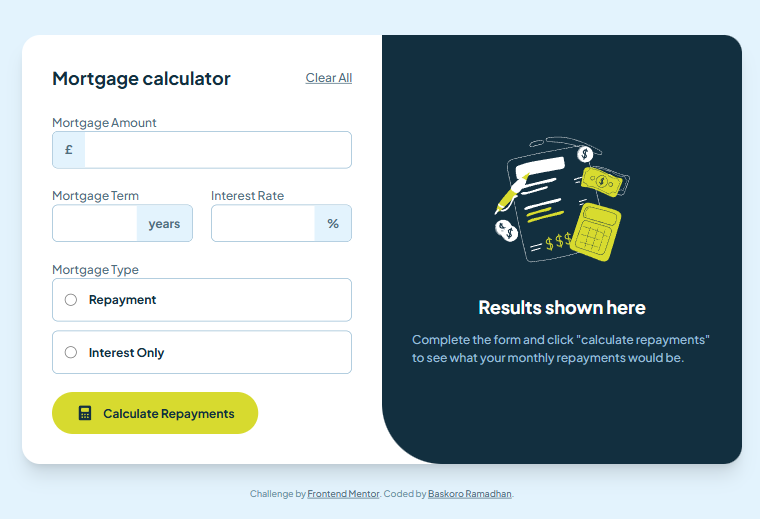

# Frontend Mentor - Mortgage Repayment Calculator Solution

This is a solution to the [Mortgage repayment calculator challenge on Frontend Mentor](https://www.frontendmentor.io/challenges/mortgage-repayment-calculator-Galx1LXK73).

## Table of contents

- [Overview](#overview)
  - [The challenge](#the-challenge)
  - [Screenshot](#screenshot)
  - [Links](#links)
- [My process](#my-process)
  - [Built with](#built-with)
  - [What I learned](#what-i-learned)
  - [Automated Testing](#automated-testing)
- [Author](#author)

## Overview

### The challenge

Users should be able to:

- Input mortgage information and see monthly repayment and total repayment amounts after submitting the form
- See form validation messages if any field is incomplete
- Complete the form only using their keyboard
- View the optimal layout for the interface depending on their device's screen size
- See hover and focus states for all interactive elements on the page
- **Bonus**: Input mortgage amount with automatic thousands separators.
- **Bonus**: Experience smooth animations when results are calculated.

### Screenshot

|        Desktop Version         |        Mobile Version         |         Empty States         |
| :----------------------------: | :---------------------------: | :--------------------------: |
|  |  |  |

### Links

- Solution URL: [Solution](https://github.com/BaskoroR725/29-Mortgage-repayment-calculator)
- Live Site URL: [Live site](https://baskoror725.github.io/29-Mortgage-repayment-calculator/)

## My process

### Built with

- [React](https://reactjs.org/) - UI Library
- [TypeScript](https://www.typescriptlang.org/) - For type safety
- [Vite](https://vitejs.dev/) - Next Generation Frontend Tooling
- [Tailwind CSS](https://tailwindcss.com/) - For styling
- [Framer Motion](https://www.framer.com/motion/) - For premium animations
- [React Hook Form](https://react-hook-form.com/) - Form management
- [Zod](https://zod.dev/) - Schema validation
- Mobile-first workflow

### What I learned

During this project, I learned how to handle complex form inputs with custom sanitization and formatting. Converting inputs to `type="text"` provided better control over characters like 'e' and decimal separators across different browsers.

```tsx
// Example of custom sanitization for decimal rates
const sanitizeFloat = (value: string) => {
  let cleaned = value.replace(/[^0-9.]/g, "");
  const parts = cleaned.split(".");
  if (parts.length > 2) {
    cleaned = parts[0] + "." + parts.slice(1).join("");
  }
  return cleaned;
};
```

### Automated Testing

I implemented automated tests using **Vitest** and **React Testing Library** to ensure the calculation logic is accurate and the UI remains robust.

To run the tests:

```bash
bun x vitest run
```

## Author

- Website - [Baskoro Ramadhan](https://github.com/BaskoroR725)
- Frontend Mentor - [@BaskoroR725](https://www.frontendmentor.io/profile/BaskoroR725)
